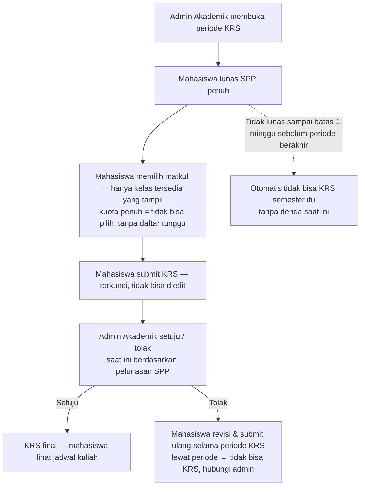
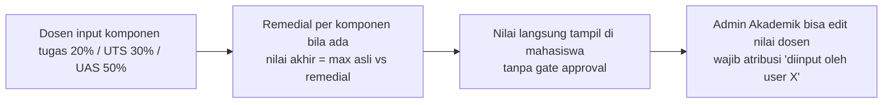
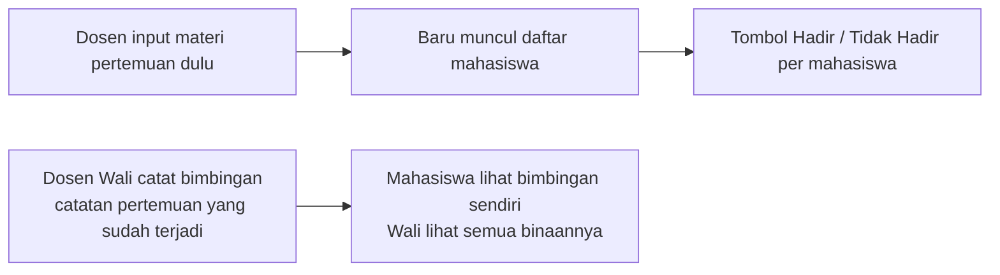

# Requirements Document — Siak (Sistem Informasi Akademik)

> **Status:** ✅ SPECIFICATION **APPROVED** (2026-08-01) — lanjut ke Developer (Iterasi 1)
> **Tanggal:** 2026-07-31 (diperbarui 2026-08-01)
> **Sumber utama:** PRD SIAKAD V2 (`source/repos/Siakad_V2/Documents/Product Requirement Document.docx`) + 20 jawaban wawancara user (tercatat di `docs/00-project-brief.md`)

---

## 1. Tujuan & Latar Belakang

Iterasi sebelumnya (Siakad, Siakad_V2, Siakad_V3) dinilai kurang memuaskan oleh pemilik, sehingga sistem **dibangun ulang dari nol** berdasarkan PRD SIAKAD V2. Tujuan: memusatkan administrasi akademik mahasiswa (profil, nilai/IPK, KRS, pembayaran) dalam satu platform digital untuk mengurangi beban administrasi manual dan memberi transparansi informasi, dengan arsitektur yang siap menangani ribuan pengguna bersamaan. Sistem dipakai di **kampus nyata** (bukan demo/aspirasi).

Keluhan non-negotiable dari iterasi lama (Confirmed Fact #11):
1. Fitur sudah berjalan, butuh perbaikan kecil;
2. **Lambat, sering gagal login, loading terus-menerus** → performa & keandalan login prioritas;
3. **Kode berantakan** → standar kualitas kode wajib;
4. **UX belum estetik, error muncul tidak pada tempatnya** → error inline & kontekstual;
5. **Scope melebar karena hak akses membingungkan** → model RBAC jelas sejak awal.

## 2. Pengguna

| Tipe | Jumlah | Deskripsi |
|------|--------|-----------|
| Mahasiswa | ±2.000 (perkiraan) | Pengguna utama; akses profil, nilai/transkrip, KRS, pembayaran |
| Dosen (Wali/Pengajar) | ±100 (perkiraan) | **Satu tipe akun**; semua dosen bisa semua fitur dosen (pilih MK, ketersediaan jadwal, jadwal mengajar, absensi, input nilai, substitute teaching, lihat payroll sendiri). Status **Wali = atribut akun** → tambahan: lihat daftar mahasiswa di kelasnya (read-only) + bimbingan mahasiswa binaan |
| Admin Akademik | ±5 | Master data, buka periode KRS, input jadwal, buka matkul, validasi KRS, edit nilai (dengan atribusi) |
| Admin Keuangan | ±5 | Tagihan & update status pembayaran, input payroll dosen |
| Admin Sistem | ±5 | **Superuser teknis** — kelola akun, akses semua modul termasuk fitur mahasiswa & dosen |

## 3. Alur Kerja Utama

### 3.1 Alur KRS (confirmed dari wawancara)

### 3.2 Alur Input Nilai

### 3.3 Alur Absensi & Bimbingan

### 3.4 Pipeline Semester (10 Langkah)

| Langkah | Deskripsi | Aktor Utama |
|---------|-----------|-------------|
| 1. **Perencanaan Akademik** | Admin Akademik: buka periode KRS, input jadwal, buka matkul per semester | Admin Akademik |
| 2. **Persiapan Keuangan** | Sistem generate tagihan otomatis di awal semester (mahasiswa lama + baru; mahasiswa baru nominal beda) | Sistem / Admin Keuangan |
| 3. **Pembayaran** | Mahasiswa bayar SPP → Admin Keuangan update status (partial diperbolehkan; lunas maksimal 1 minggu sebelum periode KRS berakhir) | Mahasiswa, Admin Keuangan |
| 4. **Pengisian KRS** | Mahasiswa pilih kelas (kuota real-time, hanya kelas tersedia; syarat lunas penuh) | Mahasiswa |
| 5. **Validasi KRS** | Admin Akademik setuju/tolak (berdasar pelunasan SPP); Dosen Wali hanya melihat daftar mahasiswa di kelasnya (read-only) | Admin Akademik |
| 6. **Perkuliahan** | Dosen: pilih MK (filter prodi) → ketersediaan jadwal (checklist dari jadwal admin) → absensi per pertemuan (wajib input materi dulu) | Dosen |
| 7. **Penilaian** | Dosen input nilai (tugas/UTS/UAS + remedial per komponen) → langsung tampil ke mahasiswa; Admin Akademik bisa edit dengan atribusi | Dosen |
| 8. **Bimbingan & Substitute** | Dosen Wali catat bimbingan (catatan pertemuan yang sudah terjadi); substitute teaching langsung aktif tanpa approval, dosen pengganti dapat akses penuh halaman dosen yang diganti | Dosen Wali, Dosen Pengganti |
| 9. **Transkrip & Payroll** | Mahasiswa unduh transkrip (PDF/Excel, IPK standar Indonesia); Admin Keuangan input payroll (visibilitas: dosen bersangkutan + admin keuangan) | Mahasiswa, Admin Keuangan |
| 10. **Audit & Monitoring** | Semua aktivitas tercatat (audit trail + atribusi); Admin Sistem supervise | Admin Sistem |

*Pipeline dijalankan per semester akademik (Ganjil/Genap).*

## 4. Kebutuhan Fungsional

**Status: ✅ Final (approved)** — semua item di bawah sudah dikonfirmasi melalui wawancara.

| ID | Deskripsi |
|----|-----------|
| F-01 | Autentikasi login dengan NIM/kredensial unik; kredensial di-hash |
| F-02 | Session timeout otomatis |
| F-03 | Proteksi SQL injection (prepared statements) |
| F-04 | Rate limiting untuk mencegah brute force |
| F-05 | Mahasiswa: lihat & edit profil (kontak) |
| F-06 | Mahasiswa: transkrip & IPK real-time per semester dan akumulasi (perhitungan standar Indonesia) |
| F-06a | Nilai akhir = komponen tugas + UTS + UAS; **setiap komponen bisa remedial**; **bobot: tugas 20% / UTS 30% / UAS 50%**; **remedial ambil nilai tertinggi** |
| F-06b | **Skala nilai lengkap:** A=4.0, A-=3.7, B+=3.3, B=3.0, B-=2.7, C+=2.3, C=2.0, D=1.0, E=0 |
| F-06c | **Matkul diulang:** nilai lama **digantikan** nilai baru (hanya nilai baru yang masuk perhitungan IPK) |
| F-07 | Mahasiswa: pengisian KRS dengan locking database (integritas kuota kelas); **kelas penuh tidak bisa dipilih — hanya kelas tersedia yang ditampilkan; tidak ada daftar tunggu** |
| F-07a | Admin: menentukan periode/window pengisian KRS per semester |
| F-07b | Struktur organisasi: fakultas → prodi; mahasiswa terikat prodi + angkatan |
| F-07c | Kurikulum: tiap prodi punya daftar matkul per semester; admin membuka matkul pada semester berjalan |
| F-07d | Kelas: satu matkul bisa punya beberapa kelas (dibedakan per dosen); kuota ±30 per kelas; mahasiswa memilih kelas berdasarkan dosen |
| F-08 | Mahasiswa: status tagihan & histori pembayaran |
| F-08a | Tagihan dibuat otomatis di awal semester untuk semua mahasiswa; 1 tagihan per semester; nominal per angkatan (bisa berbeda antar angkatan); total sudah include semua biaya |
| F-08b | Pembayaran sebagian (partial) diperbolehkan; **batas lunas: 1 minggu sebelum batas periode KRS berakhir** |
| F-08c | Syarat KRS: **lunas penuh** |
| F-08d | **Mahasiswa baru:** tagihan berbeda (biaya tes, gedung); KRS otomatis disiapkan prodi; NIM sudah ada dari sistem lain |
| F-08e | **Tidak lunas sampai batas:** otomatis tidak bisa KRS semester itu; tanpa denda (saat ini) |
| F-08f | **SPP per semester:** Ganjil Rp 970.000 / Genap Rp 950.000 (disamakan dengan V2) |
| F-09 | Admin: manajemen user & peran (RBAC) |
| F-10 | Dosen: input nilai (tugas/UTS/UAS + remedial per komponen); **nilai langsung tampil di mahasiswa tanpa approval**; Admin Akademik bisa edit menu dosen **dengan atribusi "diinput oleh X" tampak di UI**; Dosen Wali: melihat daftar mahasiswa di kelasnya (read-only) |
| F-11 | Admin Akademik: persetujuan/penolakan KRS (saat ini berdasarkan pelunasan SPP) — **revisi dari PRD** (PRD: berjenjang Dosen Wali → Admin) |
| F-12 | Admin: manajemen keuangan (update status pembayaran) |
| F-13 | Audit trail — log aktivitas sistem |
| F-14 | KRS terkunci setelah submit (tidak bisa tambah/ubah) |
| F-15 | Halaman isi KRS hanya dapat diakses setelah pembayaran lunas |
| F-16 | Unduh transkrip (PDF/Excel) |
| F-17 | Virtual waiting room saat trafik melebihi batas (Redis queue + token + WebSocket) |
| F-18 | Impor data massal dari Excel/CSV (data awal: mahasiswa, dosen, matkul) |
| F-19 | Update status pembayaran secara manual oleh admin (mode saat ini) |
| F-20 | Dosen: pemilihan MK — **hanya MK sesuai prodi yang ditentukan Admin Akademik** |
| F-21 | Dosen: ketersediaan jadwal — **memilih (checklist) dari jadwal yang sudah diinput Admin Akademik** |
| F-22 | Dosen: jadwal mengajar — kelas = matkul + dosen + jadwal; tampil untuk dosen & mahasiswa |
| F-23 | Dosen: absensi per pertemuan — **wajib input materi pertemuan dulu, baru daftar mahasiswa muncul**; tombol Hadir / Tidak Hadir |
| F-24 | Dosen: bimbingan — **catatan pertemuan yang sudah terjadi**; dosen wali menentukan progress/hasil bimbingan per pertemuan; **visibilitas: mahasiswa hanya melihat bimbingan sendiri, wali melihat semua binaannya** |
| F-25 | Dosen: substitute teaching — **dosen / Admin Akademik bisa mengajukan**; **langsung aktif tanpa approval** (karena bisa hari H); otomatis informasi ke mahasiswa; dosen pengganti **mendapat akses penuh ke halaman dosen yang diganti** (absensi, nilai di pertemuan tersebut) |
| F-26 | Dosen: payroll — **input oleh Admin Keuangan**; **visibilitas: hanya dosen bersangkutan + Admin Keuangan**; siklus dosen tetap per bulan (skema perhitungan & aturan dosen kontrak: **TBD**) |

## 5. Kebutuhan Non-Fungsional

| ID | Deskripsi |
|----|-----------|
| NF-01 | Responsive: mobile-friendly & desktop-ready |
| NF-02 | Load time < 2 detik; caching (Redis) |
| NF-03 | RBAC untuk kontrol akses |
| NF-04 | Load balancer untuk distribusi beban |
| NF-05 | Waiting room untuk antrean saat beban trafik tinggi |
| NF-06 | Stabil saat minimal **5.000** pengguna simultan (puncak hari pertama KRS) |

## 6. Integrasi

| Integrasi | Tipe | Arah | Deskripsi |
|-----------|------|------|-----------|
| Impor data awal (Excel/CSV/sistem lama) | File | Masuk (import) | Input manual + impor massal data mahasiswa/dosen/matkul saat peluncuran — **kebutuhan saat ini** |
| Payment gateway | API (aspirasi) | Keluar | Status pembayaran otomatis — **pengembangan selanjutnya** (saat ini manual) |
| PDDikti | API (aspirasi) | Dua arah | Sinkronisasi data akademik — **pengembangan selanjutnya**, detail belum dikonfirmasi |

## 7. Keamanan

| ID | Deskripsi |
|----|-----------|
| S-01 | Hashing kredensial login |
| S-02 | Session timeout (15 menit pada ruang tunggu; nilai pasti menunggu konfirmasi) |
| S-03 | Proteksi SQL injection — prepared statements |
| S-04 | Rate limiting anti brute force |
| S-05 | RBAC — hak akses per peran (Mahasiswa/Dosen/Admin Akademik/Admin Keuangan/Admin Sistem) |
| S-06 | Audit trail — log aktivitas untuk akuntabilitas |
| S-07 | Atribusi perubahan: setiap data yang diubah/di-submit (termasuk saat admin mengedit menu dosen) mencatat & menampilkan "diinput oleh user X" |

## 8. Batasan & Kendala

| ID | Deskripsi |
|----|-----------|
| K-01 | **Hosting belum diputuskan** — kemungkinan terbesar VPS/cloud (selalu online), keputusan final + admin teknis menyusul; desain harus deployment-ready di VPS, tidak terkunci pada mesin lokal |
| K-02 | **Laptop user tidak menyala 24/7** — sistem tidak boleh bergantung pada mesin lokal user; infrastruktur produksi harus mandiri |
| K-03 | **Integrasi eksternal terbatas** — payment gateway & PDDikti diprioritaskan pengembangan selanjutnya; saat ini berjalan mandiri (pembayaran manual) |
| K-04 | **Skala nyata ±5.000 simultan saat puncak KRS** — ambang waiting room disesuaikan ke skala nyata (bukan 10.000 dari PRD); keputusan nilai ambang: lihat `docs/decision-log.md` DL-11 |
| K-05 | **Payroll dosen detail TBD** — skema honor, aturan dosen kontrak, pengaruh absensi akan dipastikan user nanti; implementasi mengikuti keputusan kemudian |
| K-06 | **Kode berantakan iterasi sebelumnya** — standar kualitas kode wajib diterapkan sejak awal (lint, test, review) agar tidak terulang |
| K-07 | **Matriks RBAC kompleks** — 5 tipe akun (Mahasiswa, Dosen, Admin Akademik, Admin Keuangan, Admin Sistem) + atribut Wali; definisi hak akses harus ketat sejak requirements |
| K-08 | **NIM mahasiswa baru dari sistem lain** — sistem ini tidak generate NIM; impor data awal harus handle NIM existing (upsert) |
| K-09 | **Notifikasi real-time** — butuh WebSocket untuk waiting room + notifikasi KRS; fallback polling jika WebSocket tidak tersedia |

## 9. Kriteria Penerimaan

| ID | Kriteria |
|----|----------|
| AC-01 | Sistem stabil saat diakses minimal **5.000** pengguna simultan (puncak hari pertama KRS) |
| AC-02 | Kuota mata kuliah terkunci real-time — tidak bisa melebihi kapasitas |
| AC-03 | Halaman isi KRS tidak dapat diakses sebelum mahasiswa melakukan pembayaran **lunas penuh** (partial tidak cukup) |
| AC-04 | Persetujuan KRS dilakukan **Admin Akademik** (setuju/tolak; saat ini berdasarkan pelunasan SPP); Dosen Wali hanya melihat daftar mahasiswa di kelasnya — **revisi dari PRD** |
| AC-04a | KRS hanya dapat diisi dalam periode yang ditentukan admin; di luar periode tidak bisa |
| AC-04b | Tidak ada daftar tunggu — kuota penuh berarti kelas tidak dapat dipilih |
| AC-04c | KRS ditolak → mahasiswa bisa revisi & submit ulang selama periode KRS; lewat periode → tidak bisa KRS, hubungi admin |
| AC-04d | **Notifikasi otomatis ke mahasiswa yang belum mengisi KRS** agar segera isi |
| AC-05 | Semua perubahan data (profil/nilai) terupdate instan dengan log aktivitas |
| AC-06 | Transkrip nilai dapat diunduh (format PDF/Excel) |
| AC-07 | Setelah KRS di-submit, mahasiswa tidak bisa menambah/mengubah KRS |
| AC-08 | Login andal: tidak ada gagal login / loading tanpa henti pada beban normal (keluhan iterasi lama) |
| AC-09 | Pesan error tampil inline di tempat yang tepat (bukan popup/toast di luar konteks) — sesuai preferensi UX user |
| AC-10 | Matriks hak akses per peran terdokumentasi dan konsisten — tidak ada aksi yang bisa dilakukan di luar perannya |

## 10. Prioritas Iterasi

**Status: ✅ Final (approved)** — pemetaan iterasi ke fitur sudah disepakati; detail task di `docs/03-execution-plan.md`.

| Iterasi | Fokus | Fitur Utama (ID) | Catatan |
|---------|-------|------------------|---------|
| **Iterasi 1 (MVP Core)** | Fondasi + KRS + Nilai dasar | F-01~F-07, F-07a~F-07d, F-09~F-11, F-13~F-15, F-18, NF-01~NF-06, S-01~S-07 | Auth, RBAC, KRS flow, validasi admin, import data, audit trail, performa 5k users, waiting room MVP |
| **Iterasi 2 (Keuangan & Transkrip)** | Pembayaran & pelaporan | F-08, F-08a~F-08f, F-12, F-16, F-19 | Tagihan otomatis, SPP, status pembayaran, unduh transkrip PDF/Excel |
| **Iterasi 3 (Dosen Mengajar)** | Alur mengajar lengkap | F-10 (detail nilai), F-20~F-25 | Pilih MK, jadwal, absensi (materi wajib), bimbingan, substitute teaching |
| **Iterasi 4 (Skala & Integrasi)** | Waiting room production, integrasi | F-17 (hardening), Integrasi (payment gateway, PDDikti), F-26 (detail) | Waiting room production, payment gateway, PDDikti, payroll detail |
| **Iterasi 5 (UX & Polish)** | Perbaikan UX dari keluhan lama | AC-08, AC-09, AC-10 | Login andal, error inline, RBAC konsisten, estetika UI, E2E |

## 11. Asumsi (Eksplisit)

1. Proyek diletakkan di `C:\Users\ratih\source\repos\Siak\` (folder baru, terpisah dari iterasi lama).
2. PRD SIAKAD V2 adalah sumber kebutuhan utama; detail teknis iterasi lama tidak otomatis terbawa kecuali dikonfirmasi user.
3. Sistem dikembangkan dan dioperasikan oleh user sendiri (pengembang pribadi, laptop tidak menyala 24/7) kecuali dikonfirmasi lain.
4. Bahasa antarmuka: Bahasa Indonesia.
5. Repo git belum diinisialisasi (verifikasi 2026-08-01); pemilik menginisialisasi repo + remote sebelum Developer mulai; commit/push manual oleh pemilik.
6. Implementasi belum dimulai; Developer mulai setelah APPROVE SPECIFICATION.
7. Estimasi waktu ~24 minggu dengan asumsi 1 developer full-time.
8. Skala (semua perkiraan user): ±2.000 mahasiswa aktif, ±100 dosen, ±5 admin per peran, puncak ±5.000 simultan saat hari pertama KRS.
9. **Dosen Wali dapat melihat transkrip/IPK mahasiswa binaannya** (asumsi Analyst untuk mendukung fungsi bimbingan; belum dikonfirmasi eksplisit user — dicatat sebagai open question).
10. Kanal notifikasi (email/WA/Telegram) belum diputuskan; desain memakai abstraction/plugin, default email + notifikasi in-app.

## 12. Open Questions (Belum Terjawab)

1. Format file & struktur kolom data lama untuk impor (Excel/CSV) — belum dipastikan.
2. Keputusan final hosting (VPS/cloud mana) dan siapa admin teknis (user vs tim IT kampus).
3. Payroll: skema perhitungan honor, aturan dosen kontrak, pengaruh absensi (TBD — dijadwalkan Iterasi 4).
4. Denda keterlambatan pembayaran (saat ini tanpa denda; akan di-update user).
5. Aturan khusus matkul diulang (mis. batas pengulangan, nilai mutu) — "akan disesuaikan kemudian".
6. Visibilitas Dosen Wali terhadap transkrip binaan (lihat Asumsi #9).
7. Kanal notifikasi KRS otomatis (email/WA/Telegram).
